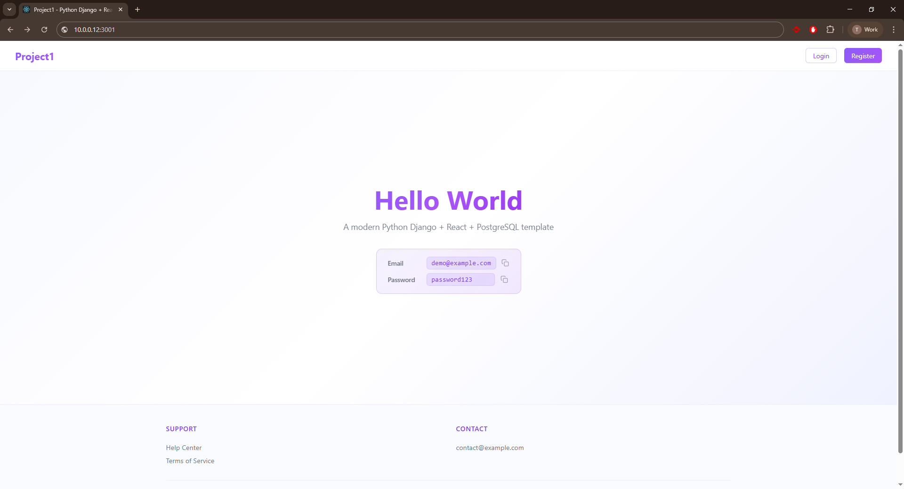

# Python Django + React + PostgreSQL + nginx

Skip the boilerplate. Start building. A production-ready full-stack template with Django, React, PostgreSQL, and Nginx — fully containerized and ready to deploy in minutes.



**Includes**
- Frontend: Basic login / logout functionality with `demo@example.com` / `password123`
- Backend: Authentication endpoint templates, decorators, custom logging, django configuration
- Nginx: Exposure to host machine, treats frontend and backend requests internally
- psql module: Flexible / customisable database request manager python scripts
- PostgreSQL Pub/Sub: Real-time updates between frontend and backend for seamless live data sync. *Coming soon*

## Table of Contents

- [Quick Start](#quick-start)
- [Project Structure](#project-structure)
- [Architecture](#architecture)
- [PSQL Manager](#psql-manager)
- [Features](#features)
- [Requirements](#requirements)
- [Clean Installation](#clean-installation)
  - [Windows Installation](WIN_INSTALL.md)
  - [Linux](#linux)
- [Docker Compose Structure](#docker-compose-structure)
- [Docker Commands](#docker-commands)
- [Setup Improvements](SETUP_IMPROVEMENTS.md)
- [Credits](#credits)

## Quick Start

### Setup

1. **Clone and configure**
```bash
git clone git@github.com:trisdesrosiers/python-react.git

# Edit .env with your configuration
cp .env_ex .env # Linux
copy .env_ex .env # Windows
```

2. **Build and run (development)**
```bash
docker compose -f docker-compose.yml -f docker-compose.dev.yml up -d
```

3. **Access the application**
```
http://localhost:3001
demo@example.com
password123
```


## Features

- ✅ Basic authentication (login/logout)
- ✅ Session-based auth with PostgreSQL backend
- ✅ Protected routes and API endpoints
- ✅ Hot-reload for both frontend and backend
- ✅ Dockerized development environment
- ✅ Easily understandable / flexible project template


## Clean Installation

### Prerequisites

**Required:**
- Docker 27.5+ 
- Docker Compose v2.36+
- Git

### My Windows Experience

For Windows installation with Docker Desktop and WSL, see the **[Windows Installation Guide](WIN_INSTALL.md)**.

### Linux & Mac
```bash
git clone git@github.com:trisdesrosiers/python-react.git

# Build and run (development)
docker compose -f docker-compose.yml -f docker-compose.dev.yml up -d
```

### Verify Installation

Visit [localhost:3001](http://localhost:3001) and login with:
- **Username:** demo@example.com
- **Password:** password123

After successful login, you're ready to customize the project template to your needs with your favorite AI!


## Project Structure

```
.
├── backend/             # Django REST API
│   ├── api/             # API views and URLs
│   ├── core/            # Decorators and utilities
│   └── project1/        # Django settings
├── frontend/            # React application
│   ├── src/
│   │   ├── components/  # React components
│   │   ├── contexts/    # Auth context
│   │   └── styles/      # CSS files
├── psql/                # Database abstraction layer
│   ├── config/          # Logging and DB connection 
│   ├── models/          # Data models
│   ├── operations/      # DB query processing logic
│   ├── requests/        # DB request handlers
│   ├── scripts/         # SQL initialization
│   └── psqlManager.py   # DB request orchestration
├── nginx.conf           # Nginx configuration (development)
├── nginx.prod.conf      # Nginx configuration (production)
├── docker-compose.yml   # Base container orchestration
├── docker-compose.dev.yml   # Development overrides
└── docker-compose.prod.yml  # Production overrides
```


## Architecture

### Services

**Backend (Django 5.2.8)**
- RESTful API with session-based authentication
- PostgreSQL integration via custom `psqlManager`
- Hot-reload enabled for development
- Port: 3000 (internal)

**Frontend (React 19.0.0)**
- Modern React with React Router for navigation
- Ant Design UI components
- Axios for API communication
- Context-based authentication state management
- Port: 3002 (internal)

**Database (PostgreSQL 15)**
- Auto-initialized with schema from `psql/scripts/01_init.sql`
- Includes roles, profiles, and registrations tables
- Demo user: `demo@example.com` / `password123`

**Nginx (Reverse Proxy)**
- Routes frontend and API requests
- Serves static files
- Port: 3001 (exposed)


## PSQL Manager

The `psql` module provides a custom database abstraction layer for managing authentication and user data. It includes:

- **Models**: `profiles`, `registrations`, `roles`
- **Manager**: Centralized database operations
- **Requests**: SQL query handlers for auth operations

### Testing PSQL Manager

Access the backend container and run test scripts:

```bash
# Enter backend container
docker exec -it project1-backend bash

# Navigate to psql directory
cd /app/psql

# Run test script
python run.py
```

Example usage in `psql/run.py`:
```python
from psql import psqlManager

manager = psqlManager.Manager(__file__)
profile = manager.getProfile(email="demo@example.com")
print(profile.firstname, profile.lastname)

# Output
Demo User
```


## Requirements

### Docker Environment
- Docker Engine 27.5.1+
- Docker Compose v2.36.2+

### Backend
- Django 5.2.8
- psycopg2-binary 2.9.10
- django-cors-headers 4.6.0
- python-decouple 3.8
- pytz 2024.2
- watchdog 5.0.3

### Frontend
- React 19.0.0
- Ant Design 5.22.6
- React Router 6.28.0
- Axios 1.7.9


## Docker Compose Structure

The project uses a 3-file Docker Compose pattern for environment separation:

| File | Purpose |
|------|---------|
| `docker-compose.yml` | **Base config** — shared settings (container names, networks, health checks, resource limits) |
| `docker-compose.dev.yml` | **Development overrides** — source code volumes, hot reload, debug settings |
| `docker-compose.prod.yml` | **Production overrides** — built assets, no source mounts, optimized settings |

```bash
# Development - mounts source code, enables hot reload
docker compose -f docker-compose.yml -f docker-compose.dev.yml up -d

# Production - uses built assets, no source volumes  
docker compose -f docker-compose.yml -f docker-compose.prod.yml up -d
```

| Setting | Development | Production |
|---------|-------------|------------|
| Source code | Mounted as volumes | Baked into image |
| Frontend | Dev server (hot reload) | Static build served by nginx |
| node_modules | Named volume | In image |


## Useful Docker Commands

```bash
# Start services (development)
docker compose -f docker-compose.yml -f docker-compose.dev.yml up -d

# Start services (production)
docker compose -f docker-compose.yml -f docker-compose.prod.yml up -d

# Stop services
docker compose down

# Rebuild services after changes
docker compose -f docker-compose.yml -f docker-compose.dev.yml build

# View logs
docker compose logs -f backend
docker compose logs -f frontend

# Access backend shell
docker exec -it project1-backend bash

# Access database
docker exec -it project1-postgres bash
psql -U postgres -d project1

# Generate migrations (run from host, not in container startup)
docker exec -it project1-backend python manage.py makemigrations
```

## Credits

Built as a starter template for rapid full-stack development with Python / React and your favorite AI. Designed for projects requiring authentication, database operations, and modern UI.

---

**Author**: Tristan Desrosiers  
**Version**: 1.0.0
