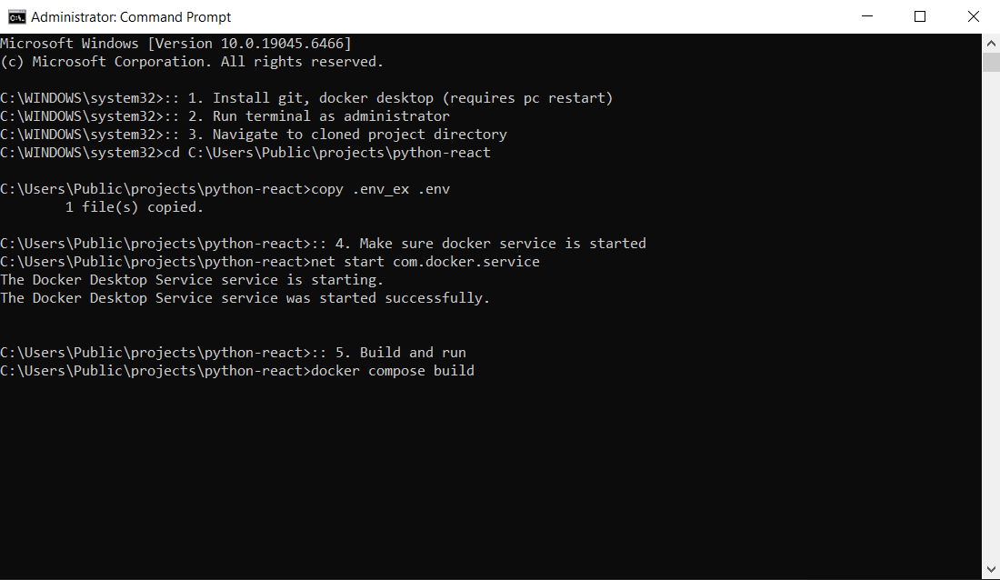
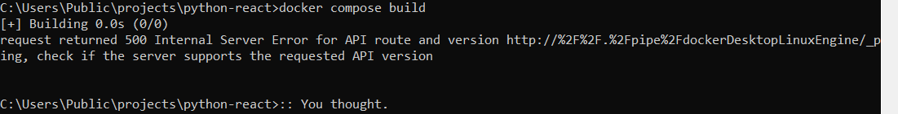
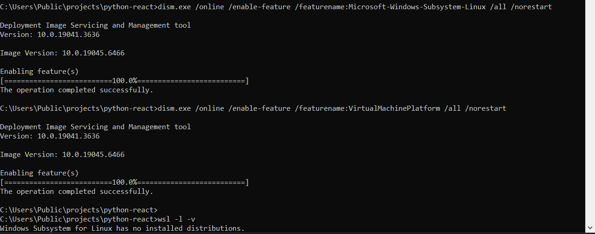
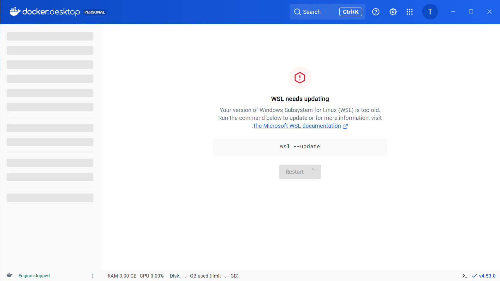
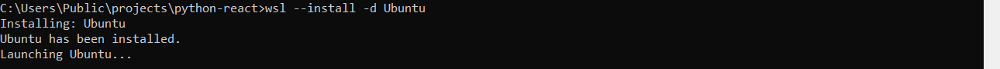
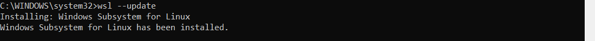
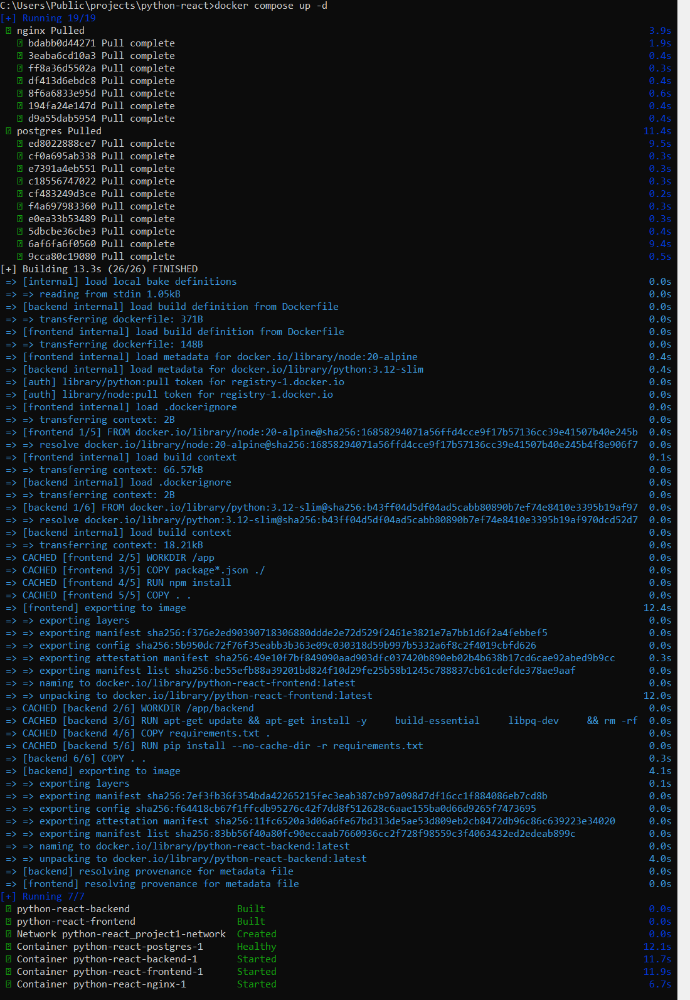

# Windows Installation Guide

This guide walks you through my experience deploying this project on my Windows 10 OS

## Step-by-Step Installation

### 1. Configure Environment

```bash
git clone git@github.com:trisdesrosiers/python-react.git

copy .env_ex .env
net start com.docker.service
docker compose build
```





### 2. Enable WSL Features

```bash
dism.exe /online /enable-feature /featurename:Microsoft-Windows-Subsystem-Linux /all /norestart
dism.exe /online /enable-feature /featurename:VirtualMachinePlatform /all /norestart
wsl -l -v
```



### 3. Open Docker Desktop

Have Docker Desktop open and ready before proceeding.



### 4. Install Ubuntu WSL

```bash
wsl --install -d Ubuntu
```



### 5. Update WSL

```bash
wsl --update
```



### 6. Start the Application

```bash
docker compose -f docker-compose.yml -f docker-compose.dev.yml up -d
```



> **Note:** On the first run, if you encounter a build cancellation error. Try `docker compose up -d` again. Wish you the best of luck!

### 7. Verify Installation

Visit [localhost:3001](http://localhost:3001) and login with:
- **Username:** demo@example.com
- **Password:** password123

After successful login, you're ready to customize the project template to your needs with your favorite AI!

---

[← Back to README](README.md)

